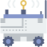
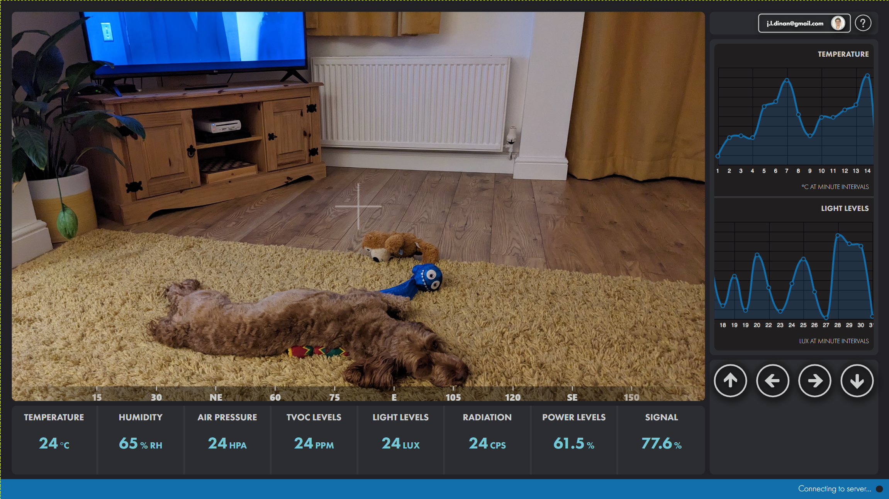
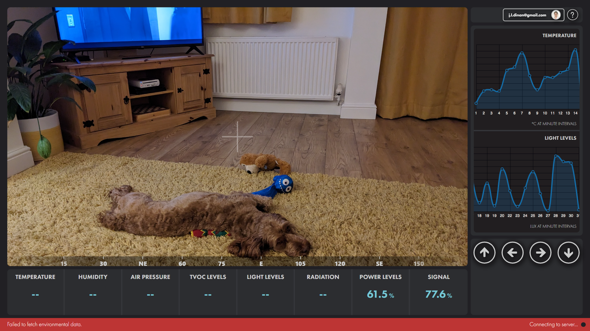
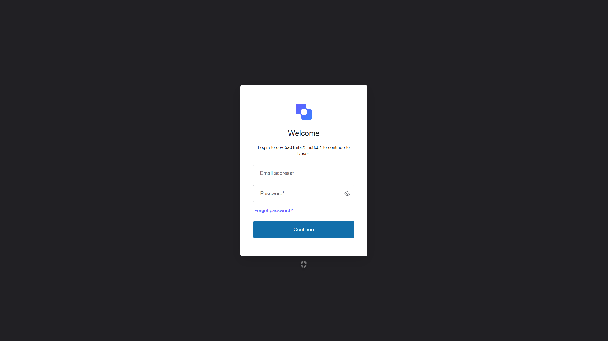

# ROVER

The intention of this project is to create a rover capable of collecting environmental data and being controlled in real-time via a web interface.

The project will utilise Arduino for lower-level sensor, motor, and actuator control, and a Raspberry Pi for video streaming, WebSocket and network connectivity, as well as other high-end video recognition projects.

For context, here is an earlier robot project I created during university: https://youtu.be/Fcm5OPSyrSg

This was capable of autonomous obstacle avoidance, and also had a custom programmable language and user interface for specifying instructions. The intention is to build something more substantial and with greater software capabilities.

## Embedded

The embedded project within this repo contains all C++ Arduino code. At the moment, this is limited to sending random test data to the C# Edge project, but it will, in future, control motors and read actual values from sensors. The initial focus of this project has been setting up some of the application environments rather than focusing on hardware building.

## Edge

The Edge project is a .NET C# service that acts as a bridge between the Arduino and the Raspberry Pi. This code runs on the Ubuntu Server Pi and reads JSON data from the serial connection - the Arduino and Pi are connected via a serial cable.

The Edge project will also contain WebSocket connection logic, and WebRTC logic for establishing real-time data and video communication between the Pi, backend server, and the frontend interfaces. The structure of this project may slightly change in the future as it is expanded to allow for this extra functionality.

In addition, the intention is to use the Pi to run more complex image recognition and other AI experiments based on the incoming video feed imagery, and feed this back to the server and UI.

## Backend

The backend project is currently a .NET REST API, utilising SQL Server and Entity Framework for the storage of environmental and other metrics. This can be queried by the frontend application.

The server-side of the project will also feature a WebSocket server to manage connections, which will be added in the future, to allow real-time push messaging to the various components.

## React Dashboard
The web application dashboard is written in React and will provide live stats and video feedback from the rover. It will also provide a UI to control the rover remotely.

The intention is to have real-time graphs, compass directions, and other readings. In future, image recognition of objects and people, as well as other experiments, will be fed back and overlaid on the video feed. In the past, I have also created some web-based augmented reality overlays and hope to recreate a similar experience.

Development is currently in the early stages and needs some tidying up (CSS specificity and isolation, unit tests, etc.), but below is a current screenshot of the implemented UI. Some of these components are yet to be fully implemented, but data is already being fed to the UI. The main aim so far has been getting the end-to-end stream of data from the Arduino through the Pi bridge and then server to UI.

The image below shows the dashboard in an error state, full error handling, user messaging, and other best practices will be considered as development continues.

Auth0 has been implemented as the identity provider, to control logging into the application and access to the rover.

